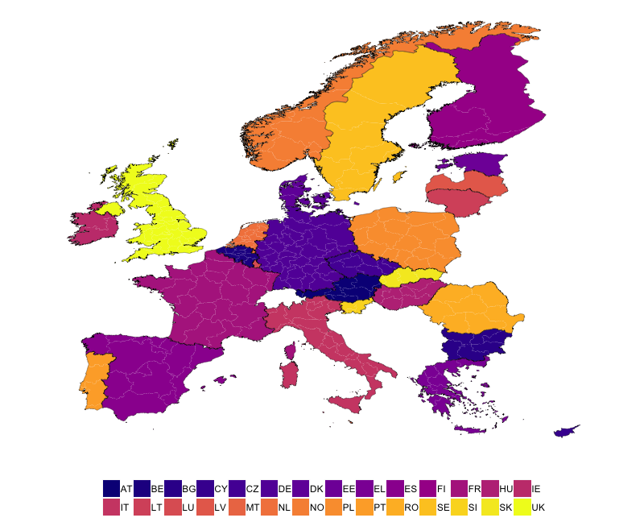
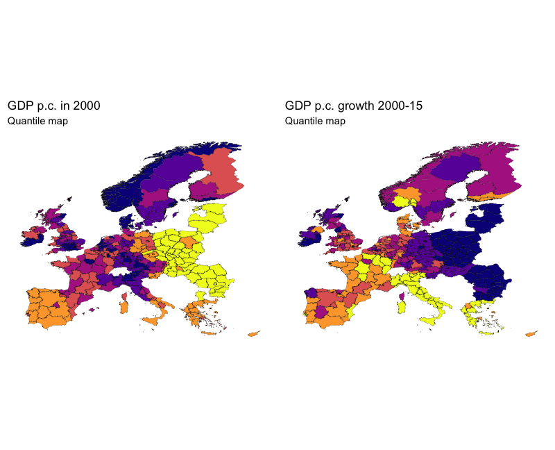
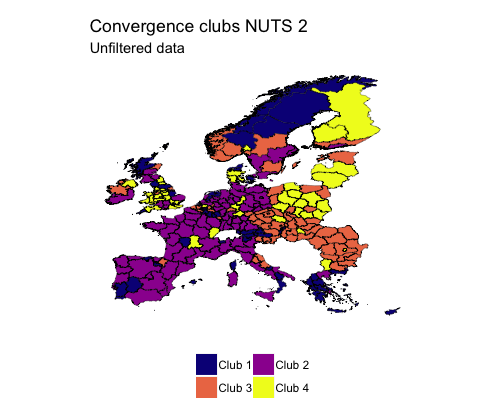
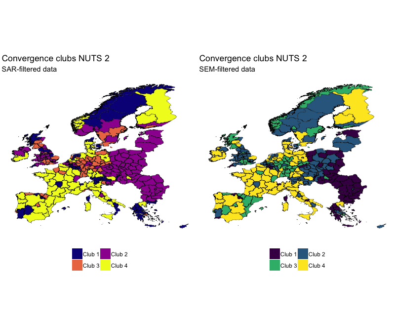

```{r include=FALSE}
# allows setting knitr code-chunk size, e.g. via size="tiny"
def.chunk.hook  <- knitr::knit_hooks$get("chunk")
knitr::knit_hooks$set(chunk = function(x, options) {
  x <- def.chunk.hook(x, options)
  ifelse(options$size != "normalsize", paste0("\\", options$size,"\n\n", x, "\n\n \\normalsize"), x)
})
library(stargazer)
```


## Data

Recap: European Regional Database by Cambridge Econometrics

We limit the dataset to:

- timeframe 2000-2015
- no Croatia (i.e. two fewer NUTS 2 regions)

This means we get to:

- use the full set of variables
- keep a detailled London (five NUTS 2 regions)

<!-- \center -->
<!-- {width=90%} -->

## CS excursion

### Regression vs. Iteration
\vspace{1em}
Fibonacci sequence: $1, 1, 2, 3, 5, 8, 13, 21, ...$

Defined by $$f(n) = f(n-1) + f(n-2)$$
with the base $$f(1) = f(2) = 1$$

<!-- Remember regression trees: -->
<!-- We try to split the observations into clubs that are similar to each other -->
<!-- We do this with a recursive function akin to: -->
<!-- Explain recursion + iteration -->


## Regression tree

Split observations into clubs:

```{r echo=TRUE, eval=FALSE}
tree <- function(data, split_vars, end_criteria) {
  split <- find_best_split(...)
  if (!end_criteria) {
    return(list(tree(split$data1, ...),
                tree(split$data2, ...)))
  } else { # if(end_criteria)
    return(data)
  }
}
```

<!-- Note that we supply different end criteria - minimum club size, maximum step size and insignificant splits -->
<!-- Other stuff includes how to divide up the scale (easier due to logs), but later more on the implementation -->

## Oh what a merry regression tree

<!-- Thus we divide up our dataset based on some splitting variables and receive trees like this one: -->
We receive a recursive, tree-like data structure that is:

- hard to deal with (**a lot** of helper functions are necessary)
- pretty nice

\center
<!-- Add pretty (?) tree, dummy ahead: -->
![A partykit [@hothorn15] tree](party_tree.png){width=90%}

## Regression Tree

Our results are comparable to partykit [@hothorn15].

Still there's the caveat of spatially filtering the data.
<!-- mention fancy distance stuff -->

## Motivation
\center
{width=80%}


## Results
\center
{width=80%}


## Results
```{r, echo=FALSE, results='asis'}
load("../../output/run.Rda")
stargazer(regs_lm, header = FALSE, font.size = "tiny", omit.stat = c("f", "rsq", "adj.rsq"),
          intercept.bottom = FALSE, title = "Regression results using unfiltered data",
          covariate.labels = c(NA, "Initial GDP p.c."), 
          dep.var.labels = "GDP p.c. growth rate 2000-15")
```


## Results
\center
{width=80%}


## Results

```{r, echo=FALSE, results='asis'}
stargazer(regs_sar, header = FALSE, font.size = "tiny", omit.stat = c("f", "rsq", "adj.rsq"),
          intercept.bottom = FALSE, title = "Regression results using SAR-filtered data",
          covariate.labels = c(NA, "Initial GDP p.c."), 
          dep.var.labels = "GDP p.c. growth rate 2000-15")
```

- partykit
- flattening trees
- try model on all?
- only spatial filtering

## Results
```{r, echo=FALSE, results='asis'}
stargazer(regs_sem, header = FALSE, font.size = "tiny", omit.stat = c("f", "rsq", "adj.rsq"),
          intercept.bottom = FALSE, title = "Regression results using SEM-filtered data",
          covariate.labels = c(NA, "Initial GDP p.c."), 
          dep.var.labels = "GDP p.c. growth rate 2000-15")
```


<!-- Lukas with results -->

- where are our clubs
- why are they split this way
- how do they compare (unfiltered, sar, sem)

## Literatur
<!-- Leave me alone -->