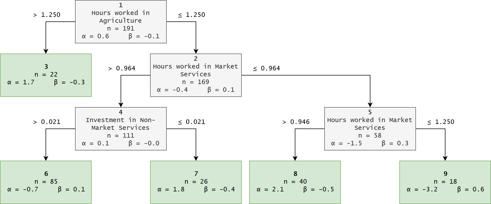

```{r include=FALSE}
# allows setting knitr code-chunk size, e.g. via size="tiny"
def.chunk.hook  <- knitr::knit_hooks$get("chunk")
knitr::knit_hooks$set(chunk = function(x, options) {
  x <- def.chunk.hook(x, options)
  ifelse(options$size != "normalsize", paste0("\\", options$size,"\n\n", x, "\n\n \\normalsize"), x)
})
```


## Data

Recap: European Regional Database by Cambridge Econometrics

We limit the dataset:

- timeframe 2000-2015
- no Croatia (i.e. two fewer NUTS 2 regions)

This means we get to:

- use the full set of variables
- keep a detailled London (five NUTS 2 regions)


## Oh what a merry regression tree

<!-- Remember regression trees: -->
<!-- We try to split the observations into clubs that are similar to each other -->
<!-- We do this with a recursive function akin to: -->
<!-- Explain recursion + iteration -->
Split observations into clubs:

```{r echo=TRUE, eval=FALSE}
tree <- function(data, split_vars, end_criteria) {
  split <- find_best_split(...)
  if (!end_criteria) {
    return(list(tree(split$data1, ...),
                tree(split$data2, ...)))
  } else { # if(end_criteria)
    return(data)
  }
}
```

<!-- Note that we supply different end criteria - minimum club size, maximum step size and insignificant splits -->
<!-- Other stuff includes how to divide up the scale (easier due to logs), but later more on the implementation -->

## Regression Tree

<!-- Thus we divide up our dataset based on some splitting variables and receive trees like this one: -->
We receive a recursive, tree-like data structure that is:

- hard to deal with (**a lot** of helper functions are necessary)
- pretty nice

\center
<!-- Add pretty (?) tree, dummy ahead: -->
{width=80%}

## Regression Tree

<!-- Daniel with rambling -->

- partykit
- flattening trees
- try model on all?
- only spatial filtering

## Results

<!-- Lukas with results -->

- where are our clubs
- why are they split this way
- how do they compare (unfiltered, sar, sem)

## Literatur
<!-- Leave me alone -->