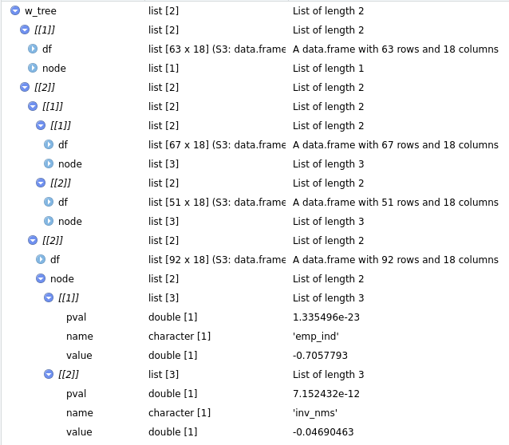
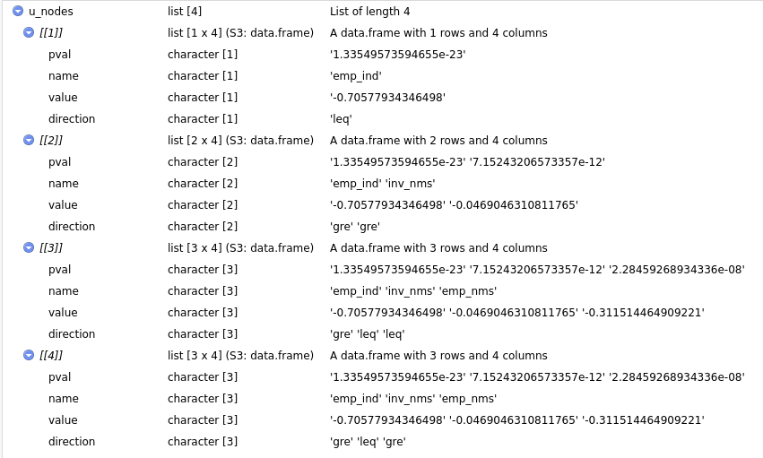
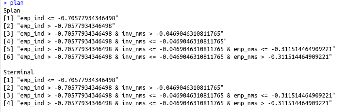
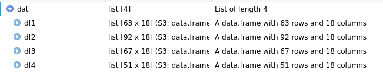

```{r include=FALSE}
def.chunk.hook  <- knitr::knit_hooks$get("chunk")
knitr::knit_hooks$set(chunk = function(x, options) {
  x <- def.chunk.hook(x, options)
  ifelse(options$size != "normalsize", paste0("\\", options$size,"\n\n", x, "\n\n \\normalsize"), x)
})
library(stargazer)
```


## Data Recap

European Regional Database by Cambridge Econometrics

We limit the dataset:

- timeframe 2000-2015
- no Croatia (i.e. two fewer NUTS2 regions)

And use the full set of variables for our 273 regions.
\center
{width=50%}


## Oh what a merry regression tree

<!-- We try to split the observations into clubs akin to: -->
Split observations into clubs:

```{r echo=TRUE, eval=FALSE}
tree <- function(data, split_vars, end_criteria) {
  split <- find_best_split(...)
  if (!end_criteria) {
    return(list(tree(split$data1, ...),
                tree(split$data2, ...)))
  } else { # if(end_criteria)
    return(data)
  }
}
```

## Regression Tree

<!-- Thus we divide up our dataset based on some splitting variables and receive trees like this one: -->
We receive a recursive, tree-like data structure that is:

- hard to deal with (**a lot** of helper functions are necessary)
- nice


<!-- Add pretty (?) tree, dummy ahead: -->
\center
{width=80%}

## Regression Tree

Our results are comparable to partykit [@hothorn15].

Still there's the caveat of spatially filtering the data.

<!-- mention fancy distance stuff -->
## Motivation
\center
{width=80%}


## Results
\center
{width=80%}


## Results
```{r, echo=FALSE, results='asis'}
load("../../output/run.Rda")
stargazer(regs_lm, header = FALSE, font.size = "tiny", omit.stat = c("f", "rsq", "adj.rsq"),
          intercept.bottom = FALSE, title = "Regression results using unfiltered data",
          covariate.labels = c(NA, "Initial GDP p.c."), 
          dep.var.labels = "GDP p.c. growth rate 2000-15")
```


## Results
\center
{width=80%}


## Results

```{r, echo=FALSE, results='asis'}
stargazer(regs_sar, header = FALSE, font.size = "tiny", omit.stat = c("f", "rsq", "adj.rsq"),
          intercept.bottom = FALSE, title = "Regression results using SAR-filtered data",
          covariate.labels = c(NA, "Initial GDP p.c."), 
          dep.var.labels = "GDP p.c. growth rate 2000-15")
```


## Results
```{r, echo=FALSE, results='asis'}
stargazer(regs_sem, header = FALSE, font.size = "tiny", omit.stat = c("f", "rsq", "adj.rsq"),
          intercept.bottom = FALSE, title = "Regression results using SEM-filtered data",
          covariate.labels = c(NA, "Initial GDP p.c."), 
          dep.var.labels = "GDP p.c. growth rate 2000-15")
```


- club-plots
- some first LM vs. SAR vs. SEM comparisons

## Implementation I

1. Grow the tree

\center
{width=80%}

## Implementation II

2. Fell the tree

\center
{width=80%}

## Implementation II

```{r echo=TRUE, message=FALSE, warning=FALSE, eval=FALSE}
untree <- function(nodes, simplify = FALSE){
  out <- list()
  lumberjack <- function(nodes){ 
    # ...
    parent <- parent.frame()
    pos <- length(parent$out) + 1
    # if(...){ ...
    }else if(term_leq){
      parent$out[[pos]] <- leq
      Recall(gre)
    }
  #...} # lumberjack
  lumberjack(nodes)
  return(out)
}

```

## Implementation III

3. Plan the furniture

\center


```{r,echo=TRUE, eval=FALSE}
cumPaste <- function(vec, collps = NULL){
  return(sapply(vec, function(x)
    paste(vec[1:which(vec == x)], collapse = collps)))
}
```

## Implementation IV

4. Build the furniture

- E.g. for terminal nodes:
\center


- ```lapply(dat, ...)``` desired regression function

## Computational concerns

- Looping

    - For each splitting variable
        - For each value in variable
    
- Rcpp [@dirk]

1. Write function in C++
```{c, eval = FALSE,echo = TRUE}
// [[Rcpp::export]]
NumericVector get_var_stat(arma::rowvec & y, 
                           arma::mat & X, arma::vec & Z,
                           double min_obs){ // ... }
```

2. Source in R
```{r, eval = FALSE, echo = TRUE }
Rcpp::sourceCpp("get_var_stat.cpp")
```


## Literature

<!-- Leave me alone -->